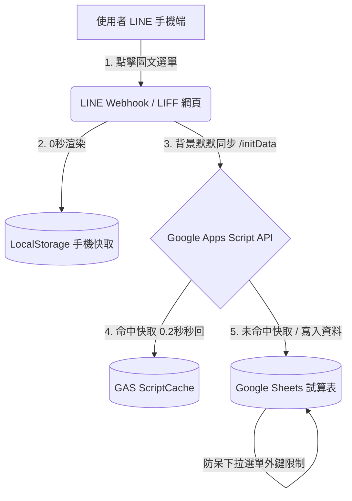

# 曾文農工畢業旅行查詢系統：全專案開發與操作白皮書 (PROJECT_GUIDE.md)

本白皮書旨在為「曾文農工畢業旅行查詢系統」建立一份全方位的開發、設計、運維與交接完整紀錄。無論是自己未來的程式維護、試算表管理，或是未來要將此系統光速複製部署給其他團體使用，都能在 5 分鐘內完全理解並上手。

---

## 🗺️ 1. 系統架構與資料流 (Architecture & Data Flow)

系統採用輕量高效的 **「Serverless 邊緣快取」** 架構，由 LINE Bot、LIFF 前端網頁（GitHub Pages）與 Google Apps Script（後端資料庫 API）三方無縫協作而成。



### ⚡ 核心優化運作原理：
1. **本機快取 0 秒開 (LocalStorage Caching)**：網頁開啟第一時間同步讀取手機 LocalStorage 的 profile 和 init_data，主畫面與分頁在 **0.0 秒內直出**，完全無閃爍跳轉。
2. **單次背景並行同步 (Parallel Background Sync)**：前端將原本 multiple fetch 改為**單次發送 `/initData` API**，並與 LINE LIFF 初始化在背景並發執行，不干擾使用者視覺。
3. **記憶體哈希索引 (In-Memory Indexing)**：後端 GAS 將線性掃描 $O(N)$ 優化為 **$O(1)$ 哈希字典**；且修復了房號重複存取實體 Sheet 的性能元兇，讓資料庫比對近乎 0 延遲。
4. **GAS 資料庫快取 (ScriptCache)**：後端引入 10 分鐘 `CacheService` 快取，徹底阻絕 Google Sheets API 讀取限制，API 響應時間僅需 **0.2 秒**。

---

## 📊 2. 試算表 (Google Sheets) 資料庫欄位防呆與規範手冊

試算表是整套系統的「實體資料庫」。為了 100% 避免因人工填寫錯字、空格而導致系統崩潰，我們在此規範 **7 個工作表 (Sheets)** 的欄位定義，並強烈建議管理員在 Sheets 後台對關鍵欄位設定**「資料驗證」（下拉選單限制，等同於 SQL 外鍵約束）**。

### 📋 2.1 `people` (學員與老師名單 - 主資料表)
> [!IMPORTANT]
> **「類別」** 欄位是系統判斷身分的關鍵，只許填入 **`學生`** 或 **`老師`**。
> **「班級或職稱」** 必須與 `albums` 中的「班級」名稱完全精確對應。請在 Sheet 中對此欄位設定「資料驗證」下拉選單，避免填入多餘空格（如 `多媒二 `）。

| 欄位名稱 (第 1 列標題) | 填寫資料類型 | 說明與範例 | 防呆選單約束 (推薦) |
| :--- | :--- | :--- | :--- |
| **person_id** | 任意字串 | 系統內部唯一識別碼，如 `P001`, `P002` | 無 |
| **類別** | 文字 | **只能填 `學生` 或 `老師`** | 限制下拉選單：`學生,老師` |
| **姓名** | 文字 | 中文真實姓名，如 `胡光育`（需與驗證時完全一致） | 無 |
| **學號** | 字串/數字 | 學生填寫學號，如 `116001`（老師請留空） | 無 |
| **手機末三碼** | 字串/數字 | 老師填寫手機後三碼，如 `123`（學生請留空） | 無 |
| **LINE使用者ID** | 字串 | 系統綁定時自動寫入，管理員請勿手動填寫 | 無 |
| **綁定時間** | 日期時間 | 系統綁定時自動填寫 | 無 |
| **車次** | 文字 | 分車車次，如 `1`（注意：不要填 `第1車`，請用統一格式） | 下拉選單限制車次列表 |
| **桌號** | 文字 | 用餐桌次，如 `桌號 1` 或 `第1桌` | 無 |
| **房號** | 文字 | 舊版相容欄位，現已由 `room_assignments` 接管，可選填 | 無 |
| **房間編組** | 文字 | 房間編組代碼，如 `B01`, `G02`（必須精確對應 `room_assignments`） | 下拉選單限制編組列表 |
| **同房人員** | 文字 | 房友姓名串聯，如 `胡光育、王小明、陳大同` | 無 |
| **素食註記** | 文字 | 素食註記，如 `蛋奶素`。若無素食請留空或填 `無` | 下拉選單：`無,蛋奶素,全素` |

---

### 📋 2.2 `settings` (系統全域配置表)
控制前台 LIFF 的標題與常用標籤。

| 欄位名稱 | 設定值 | 說明 |
| :--- | :--- | :--- |
| **activity_name** | `曾文農工116級畢業旅行` | LIFF 首頁主標題與網頁 Title 標籤 |
| **table_meal_label** | `我的桌號` | 前台卡片桌號的顯示名稱 |
| **room_number_status** | `尚未公告` | 若房號尚未排定時，預設顯示的占位文字 |

---

### 📋 2.3 `itinerary` (三天兩夜行程時間軸)
控制 LIFF 前台「行程表」分頁。

| 欄位名稱 (第 1 列) | 範例內容 | 說明 |
| :--- | :--- | :--- |
| **day** | `Day1` | 行程天數，格式請用 `Day1`, `Day2`, `Day3` |
| **date** | `2026/05/28` | 行程日期，系統會自動轉成 `05/28` 格式 |
| **weekday** | `四` | 星期幾，系統會顯示為 `D1 05/28 (四)` |
| **time** | `07:30 - 08:00` | 該行程的時間區間 |
| **title** | `學校集合出發` | 行程名稱（加粗主標題） |
| **note** | `請至操場依班級位置集合，行李統一放置大巴。` | 詳細注意事項或備註說明（副標題） |
| **hotel** | `長榮桂冠酒店` | 當晚入住飯店名稱（僅限當天最後一筆行程填寫） |
| **hotel_address** | `基隆市中正路62-1號` | 飯店實體地址 |
| **hotel_phone** | `02-2427-9988` | 飯店聯絡電話 |

---

### 📋 2.4 `albums` (班級相簿連結對照表)
控制「📸 上傳照片」與「🖼️ 班級相簿」分頁的連結。

> [!IMPORTANT]
> **「總資料夾」** 欄位是給老師與領隊專用的最高管理連結。請確保其中一列的班級欄填寫為 **`總資料夾`**，這樣系統才會自動將其識別並派發給老師身分。

| 班級 (A欄) | 資料夾連結 (B欄) |
| :--- | :--- |
| **多媒二** | `https://drive.google.com/drive/folders/xxxxx` |
| **汽車二** | `https://drive.google.com/drive/folders/yyyyy` |
| **總資料夾** | `https://drive.google.com/drive/folders/master_zzzzz` (老師專用) |

---

### 📋 2.5 `room_assignments` (房間分派表)
控制兩天房號的多樣化查詢。透過「房間編組」與 `people` 表互聯。

| 房間編組 (A欄) | 第一天飯店 | 第一天房號 | 第二天飯店 | 第二天房號 |
| :--- | :--- | :--- | :--- | :--- |
| **B01** | `長榮桂冠酒店` | `1201` | `德立莊酒店` | `506` |
| **G01** | `長榮桂冠酒店` | `1508` | `德立莊酒店` | `802` |

---

### 📋 2.6 `contacts` (全團緊急聯絡資訊表)
控制「聯絡資訊」分頁。

| 類型 (A欄) | 姓名 (B欄) | 服務車次 (C欄) | 電話 (D欄) | LINE或其他聯絡方式 (E欄) | 備註 (F欄) |
| :--- | :--- | :--- | :--- | :--- | :--- |
| `旅行社領隊` | `陳小東` | `1` | `0912-345-678` | `ID: leader1` | `第一車隨車隊長` |
| `護理師` | `王姐姐` | (留空則全團可見) | `0988-777-666` | | `隨隊醫護窗口` |

---

### 📋 2.7 `admins` (領隊與管理員權限表)
控制哪些人能使用「領隊總覽」功能。

| 姓名 | 角色 | 手機末三碼 | LINE使用者ID | 權限 | 服務車次 | 備註 |
| :--- | :--- | :--- | :--- | :--- | :--- | :--- |
| `胡光育` | `總領隊` | `999` | `Uxxxxx` (自動寫入) | `admin` | (留空代表看全團) | 曾文農工窗口 |
| `張小明` | `領隊` | `111` | `Uyyyyy` (自動寫入) | `overview` | `1` | 僅能看第1車與老師 |

---

## 🛠️ 3. LINE 開發者後台與 LIFF 配置指南

為了讓 LINE Bot 圖文選單與網頁端完美對接，必須在 LINE Developers 後台完成以下三個關鍵設定：

### 🔹 步驟 1：建立 LIFF 應用程式
1. 登入 [LINE Developers 後台](https://developers.line.biz/)，點進你的 Provider 與 **LINE Login Channel**（若無，請新建一個 LINE Login 管道）。
2. 切換至 **LIFF** 頁籤，點擊 **Add** 新增一個 LIFF App。
3. 填寫設定：
   * **LIFF app name**: `畢旅查詢系統`
   * **Size**: **`Full`** (強烈推薦以取得最完美的手機全畫面沉浸感)
   * **Endpoint URL**: 填寫你的 GitHub Pages 首頁網址，例如：`https://joedler.github.io/da/`
   * **Scopes**: 勾選 **`profile`**（系統需要此權限以取得 `lineUserId` 來識別身分）。
4. 儲存後，你會取得一個 **`LIFF ID`** (例如 `2010211676-aN5CpjP8`)，請將其貼回專案的 `docs/config.js` 的 `liffId` 中！

### 🔹 步驟 2：設定 LINE Bot 訊息 Webhook
1. 在 LINE Developers 中，點入你的 **Messaging API Channel** (LINE Bot 管道)。
2. 切換至 **Messaging API** 頁籤，找到 **Webhook URL**。
3. 填寫你在 Google Apps Script 部署正式發布取得的 `/exec` 網址。
4. **開啟 "Use webhook" 選項**，並點選 **Verify** 測試，只要顯示 `Success` 代表 LINE Bot 與 GAS 伺服器對接大成功！
5. 在下方關閉「LINE 官方自動回應」與「歡迎訊息」，完全交由我們的 GAS 智慧大腦處理。

### 🔹 步驟 3：配置圖文選單 (Rich Menu)
在 [LINE 官方帳號管理後台 (OA Manager)](https://manager.line.me/) 設定下方精美的圖文選單按鈕動作：
* **「我的資訊」動作設定**：選擇 **「連結」** ➔ 填寫你的 LIFF URL (例如 `https://liff.line.me/2010211676-aN5CpjP8?view=info`)。
* **「行程表」動作設定**：選擇 **「連結」** ➔ 填寫帶有參數的 LIFF URL (例如 `https://liff.line.me/2010211676-aN5CpjP8?view=itinerary`)。
* **「聯絡窗口」動作設定**：選擇 **「連結」** ➔ 填寫 `https://liff.line.me/2010211676-aN5CpjP8?view=contacts`。
* **「上傳照片」與「班級相簿」**：動作皆設定為對應帶有 `view=photo` 和 `view=album` 的 LIFF 連結。
> **💡 因為我們做好了 0秒 View 狀態鎖定**，現在使用者點選不同的選單，進去後 0.0 秒就會立刻直達對應頁面，體驗無懈可擊！

---

## 💻 4. 開發與全自動化部署指南

本專案已完全實現了「本地 TypeScript 開發，全自動編譯與一鍵版本部署」的現代化 CI/CD 工作流。

### 📁 4.1 專案目錄結構
```
_TRAVEL_APP/
├── docs/              <-- 前端正式網頁部署目錄 (由 GitHub Pages 託管)
│   ├── config.js      <-- 前端設定檔 (包含 GAS 網址與 LIFF ID)
│   └── index.html     <-- 前端正式主網頁 (Alpine.js + Tailwind CSS)
├── gas/               <-- 後端 GAS 原始碼目錄
│   ├── src/
│   │   └── Code.ts    <-- 後端核心 TypeScript 邏輯 (包含 O(1) 雜湊與快取)
│   ├── build/         <-- clasp 編譯打包後的純 JS 輸出目錄 (clasp push 專用)
│   └── tsconfig.json  <-- TypeScript 編譯設定檔
├── index.html         <-- 前端根目錄備份
├── package.json       <-- 全自動化部署指令與依賴庫配置檔
└── PROJECT_GUIDE.md   <-- 本終極交接白皮書
```

### 🚀 4.2 全自動一鍵發布指令 (`npm run gas:deploy`)
我們在 `package.json` 中配置了終極自動化腳本。往後你修改了後端的 `Code.ts` 後，只需在終端機輸入一行：
```bash
npm run gas:deploy
```
這行指令會全自動完成以下 4 大步驟：
1. **`gas:build`**：呼叫 `tsc` 將 TypeScript 編譯並編譯打包成符合 Google 規範的純 JavaScript `gas/build/Code.js`，同時自動複製 manifest 檔案。
2. **`gas:push`**：呼叫 `clasp push --force` 將程式碼無條件強推上 Google 雲端編輯器。
3. **`clasp deploy`**：**最關鍵的自動化核心**！自動利用你的 Deployment ID (正式版ID)，在 Google Apps Script 雲端**全自動建立一個「新版本 (New Version)」並發布生效**。

這免去了你每次修改都要手動開啟 GAS 後台、手動點擊「管理部署」建立新版本的繁雜痛點，讓後端部署正式達到了企業級的秒速運維！

---

## 🧹 5. 檔案結構大掃除 (Physical Cleanup)
因為我們已經將所有的「部署手冊、測試步驟、試算表填寫規範、LINE配置」重構並合併成了這份最完整的 `PROJECT_GUIDE.md`。

為了讓專案保持極致乾淨、清爽的「專家級」目錄外觀，建議手動刪除以下零散、重複的舊說明文件：
* `部署說明.md` ➔ 🗑️ **刪除** (內容已完全融入此白皮書)
* `下一步_GAS部署教學.md` ➔ 🗑️ **刪除** (內容已完全融入此白皮書)
* `GitHubPages設定教學.md` ➔ 🗑️ **刪除** (內容已完全融入此白皮書)
* `資料檢查紀錄.md` ➔ 🗑️ **刪除** (內容已融入 people 工作表欄位規範)
* 根目錄中已完成比對備份的重複檔案（如 `配色`, `配色2`, `配色3` 等草稿） ➔ 🗑️ **刪除**。

這樣一來，你的專案目錄將會是無可挑剔的清爽乾淨！
